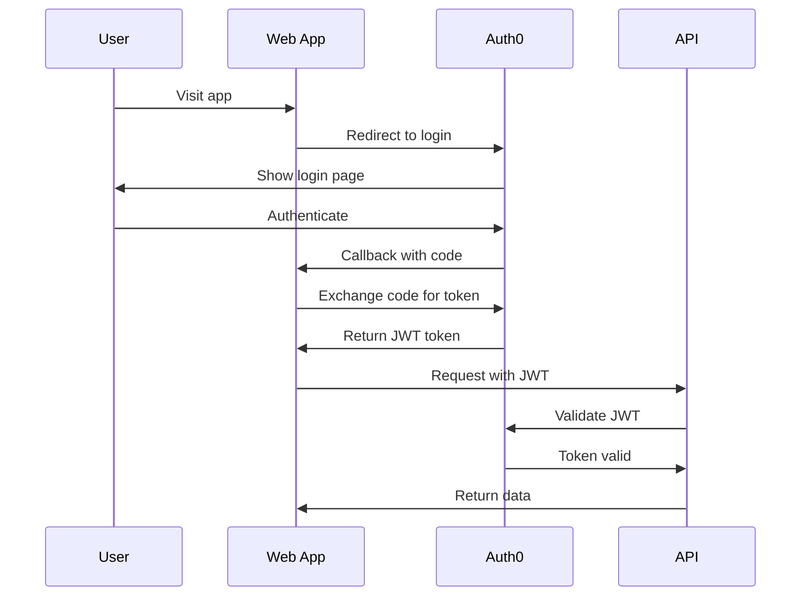

# System Architecture

## Overview

This is a **portfolio management application** built as a Turborepo monorepo. Users can authenticate, create multiple investment portfolios, track stock positions, record transactions, and visualize dividend income.

> **💡 For detailed technical stack and development commands**, see [AGENTS.md](../../AGENTS.md) in the root directory.

---

## Monorepo Structure

```
portfolio/
├── apps/
│   ├── web/          # Next.js 15 frontend (App Router)
│   └── api/          # NestJS backend API
├── packages/
│   ├── database/     # Prisma schema and client
│   ├── env/          # Shared environment variables
│   ├── shared/       # Shared utilities and types
│   └── typescript-config/
└── docs/             # All documentation
```

---

## Frontend (`apps/web`)

**Framework**: Next.js 15 with App Router
**Key Features**:

- Auth0 authentication
- Internationalization (en, es)
- Real-time portfolio tracking
- Dividend visualization
- Responsive design with Tailwind CSS v4

**Tech Stack**:

- TypeScript, React 19, Tailwind CSS
- React Query for data fetching
- Jest + React Testing Library

**Key Routes**:

- `/[locale]/dashboard` - Main dashboard with portfolio overview
- `/[locale]/portfolio/[id]` - Individual portfolio details
- `/[locale]/dividends` - Dividend tracking and analytics
- `/api/auth/*` - Auth0 authentication endpoints

---

## Backend (`apps/api`)

**Framework**: NestJS
**Key Features**:

- RESTful API with OpenAPI/Swagger docs
- JWT authentication (Auth0)
- PostgreSQL database with Prisma ORM
- Transaction management
- Portfolio and position calculations

**Tech Stack**:

- TypeScript, NestJS
- Prisma ORM
- Zod validation (via `nestjs-zod`)

**Key Endpoints**:

- `/api/portfolios` - Portfolio CRUD operations
- `/api/transactions` - Transaction management
- `/api/positions` - Portfolio positions and metrics
- `/api/dividends` - Dividend analytics

---

## Database (`packages/database`)

**Database**: PostgreSQL (hosted on Neon)
**ORM**: Prisma

**Core Models**:

- `User` - Authenticated users
- `Portfolio` - Investment portfolios
- `Transaction` - Financial transactions
- `Stock` - Stock information
- `Currency` - Currency types
- `UserPosition` - Aggregated positions (view)

> **📚 Detailed schema documentation**: See [Database Schema](./database-schema.md)

---

## Authentication Flow



**Implementation**:

- **Frontend**: Auth0 SDK (`@auth0/nextjs-auth0`)
- **Backend**: JWT validation with Auth0 public keys
- **Token Management**: Automatic refresh and error handling

> **📚 Detailed auth documentation**: See [API Authentication](./API_AUTHENTICATION.md)

---

## Data Flow

### Frontend → Backend Communication

1. **Component** calls custom hook (e.g., `usePortfolios()`)
2. **Hook** uses `useApiClient()` to get authenticated client
3. **ApiClient** sends HTTP request with JWT bearer token
4. **NestJS API** validates token and processes request
5. **Prisma** queries PostgreSQL database
6. **Response** flows back through the stack to component

### State Management

- **Authentication**: React Context (`AuthContext`)
- **Server State**: React Query (`@tanstack/react-query`)
- **UI State**: React `useState` / `useReducer`

---

## Key Features

### 1. Multi-Portfolio Management

- Users can create unlimited portfolios
- Each portfolio tracks multiple stocks
- Support for multiple currencies
- Portfolio-level analytics and metrics

### 2. Transaction Tracking

- Buy, sell, dividend transactions
- Tax tracking
- Commission and fee tracking
- Automatic position calculation

### 3. Dividend Analytics

- Historical dividend tracking
- Dividend income visualization
- Dividend yield calculations
- Projected dividend income

### 4. Internationalization

- English and Spanish support
- Locale-based routing (`/en/*`, `/es/*`)
- Currency and date formatting

### 5. Accessibility

- WCAG 2.1 AA compliance
- Screen reader support
- Keyboard navigation
- High contrast mode support

---

## Development Workflow

### Local Development

```bash
# Install dependencies
pnpm install

# Start all apps (web + api)
pnpm dev

# Start specific app
pnpm --filter @repo/web dev
pnpm --filter @repo/api dev
```

### Database Migrations

```bash
# Create and apply migration
pnpm --filter @repo/database db:migrate

# Open Prisma Studio
pnpm --filter @repo/database db:studio
```

### Testing

```bash
# Run all tests
pnpm test

# Type checking
pnpm typecheck

# Linting
pnpm lint
```

---

## Deployment

**Frontend**: Vercel
**Backend**: Vercel Serverless Functions
**Database**: Neon (PostgreSQL)

> **📚 Detailed deployment guide**: See [DEPLOYMENT.md](../DEPLOYMENT.md)

---

## Performance Optimizations

### Frontend

- Code splitting with Next.js dynamic imports
- Image optimization with `next/image`
- Font optimization with `next/font`
- Bundle size optimization (Tailwind purging)

### Backend

- Database query optimization
- Connection pooling
- Pagination for large datasets
- Caching strategies

### Database

- Indexed foreign keys
- Unique constraints for data integrity
- Materialized views for complex queries

---

## Security

### Authentication

- Auth0 for identity management
- JWT bearer tokens
- Token rotation and refresh
- Secure session handling

### API Security

- Input validation with Zod schemas
- SQL injection prevention (Prisma ORM)
- CORS configuration
- Rate limiting (planned)

### Data Protection

- Password hashing (bcrypt)
- Environment variable protection
- HTTPS enforcement

---

## Related Documentation

- **[Database Schema](./database-schema.md)** - Detailed database model documentation
- **[API Authentication](./API_AUTHENTICATION.md)** - Authentication implementation details
- **[AGENTS.md](../../AGENTS.md)** - Quick reference for AI agents
- **[API Product Requirements](../product/API_PRD.md)** - API feature roadmap
- **[Setup Guide](../SETUP.md)** - Development environment setup
- **[Deployment Guide](../DEPLOYMENT.md)** - Production deployment instructions

---

**Last Updated**: 2024-12-04
